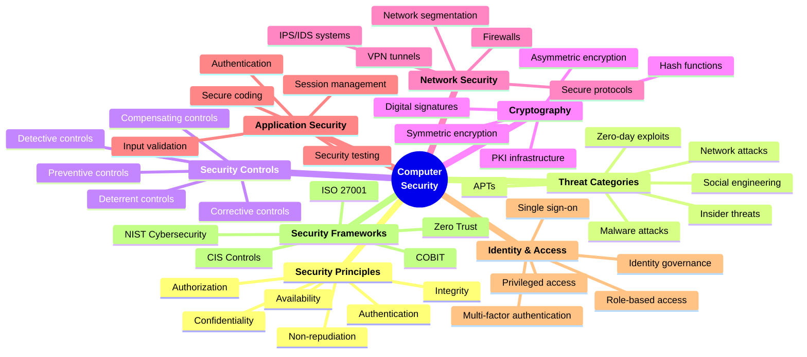

```mermaid
mindmap
  root((<b>Computer<br>Security</b>))
    <b>Security Principles</b>
      Confidentiality
      Integrity
      Availability
      Authentication
      Non-repudiation
      Authorization
    <b>Threat Categories</b>
      Malware attacks
      Social engineering
      Network attacks
      Insider threats
      APTs
      Zero-day exploits
    <b>Security Controls</b>
      Preventive controls
      Detective controls
      Corrective controls
      Deterrent controls
      Compensating controls
    <b>Cryptography</b>
      Symmetric encryption
      Asymmetric encryption
      Hash functions
      Digital signatures
      PKI infrastructure
    <b>Network Security</b>
      Firewalls
      VPN tunnels
      IPS/IDS systems
      Network segmentation
      Secure protocols
    <b>Application Security</b>
      Secure coding
      Input validation
      Authentication
      Session management
      Security testing
    <b>Identity & Access</b>
      Multi-factor authentication
      Single sign-on
      Role-based access
      Privileged access
      Identity governance
    <b>Security Frameworks</b>
      NIST Cybersecurity
      ISO 27001
      CIS Controls
      COBIT
      Zero Trust
```

