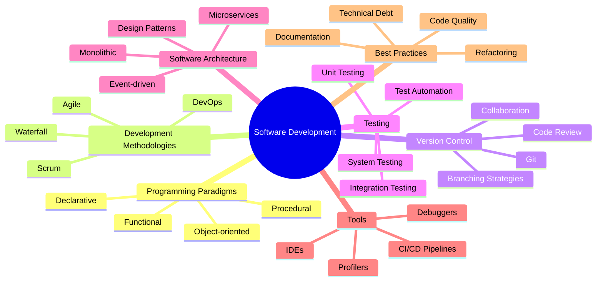

```mermaid
mindmap
  root((Software Development))
    Programming Paradigms
      Object-oriented
      Functional
      Procedural
      Declarative
    Development Methodologies
      Agile
      Scrum
      Waterfall
      DevOps
    Version Control
      Git
      Branching Strategies
      Collaboration
      Code Review
    Testing
      Unit Testing
      Integration Testing
      System Testing
      Test Automation
    Software Architecture
      Design Patterns
      Microservices
      Monolithic
      Event-driven
    Tools
      IDEs
      Debuggers
      Profilers
      CI/CD Pipelines
    Best Practices
      Code Quality
      Documentation
      Refactoring
      Technical Debt
```

