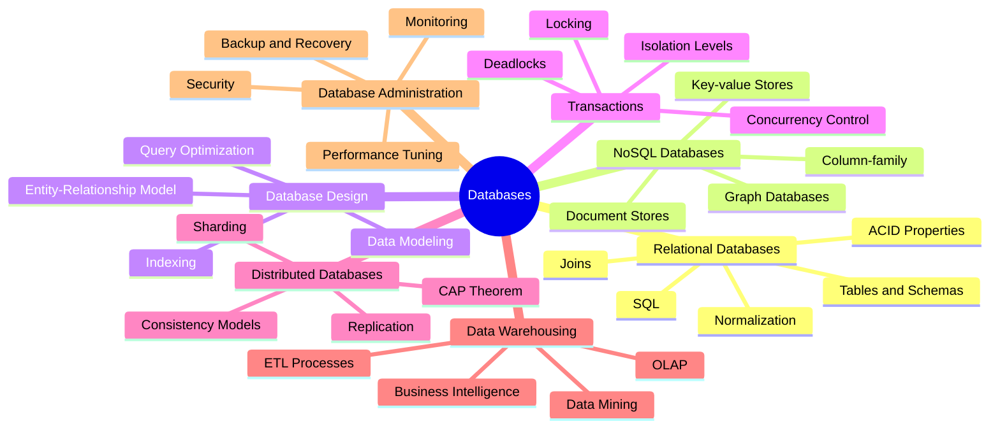

```mermaid
mindmap
  root((Databases))
    Relational Databases
      SQL
      Tables and Schemas
      Normalization
      ACID Properties
      Joins
    NoSQL Databases
      Document Stores
      Key-value Stores
      Column-family
      Graph Databases
    Database Design
      Entity-Relationship Model
      Data Modeling
      Indexing
      Query Optimization
    Transactions
      Concurrency Control
      Locking
      Isolation Levels
      Deadlocks
    Distributed Databases
      Replication
      Sharding
      CAP Theorem
      Consistency Models
    Data Warehousing
      ETL Processes
      OLAP
      Data Mining
      Business Intelligence
    Database Administration
      Backup and Recovery
      Performance Tuning
      Security
      Monitoring
```

