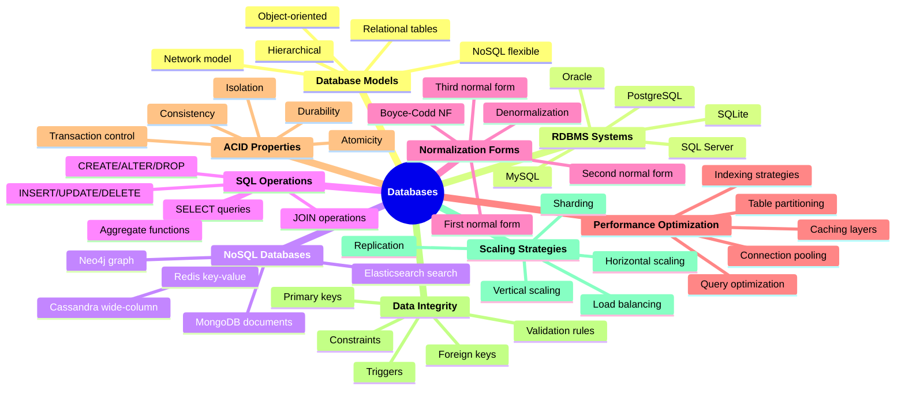

```mermaid
mindmap
  root((<b>Databases</b>))
    <b>Database Models</b>
      Relational tables
      NoSQL flexible
      Object-oriented
      Hierarchical
      Network model
    <b>RDBMS Systems</b>
      Oracle
      MySQL
      PostgreSQL
      SQL Server
      SQLite
    <b>NoSQL Databases</b>
      MongoDB documents
      Cassandra wide-column
      Redis key-value
      Neo4j graph
      Elasticsearch search
    <b>SQL Operations</b>
      SELECT queries
      INSERT/UPDATE/DELETE
      CREATE/ALTER/DROP
      JOIN operations
      Aggregate functions
    <b>Normalization Forms</b>
      First normal form
      Second normal form
      Third normal form
      Boyce-Codd NF
      Denormalization
    <b>Performance Optimization</b>
      Indexing strategies
      Query optimization
      Table partitioning
      Caching layers
      Connection pooling
    <b>ACID Properties</b>
      Atomicity
      Consistency
      Isolation
      Durability
      Transaction control
    <b>Data Integrity</b>
      Primary keys
      Foreign keys
      Constraints
      Triggers
      Validation rules
    <b>Scaling Strategies</b>
      Vertical scaling
      Horizontal scaling
      Replication
      Sharding
      Load balancing
```

