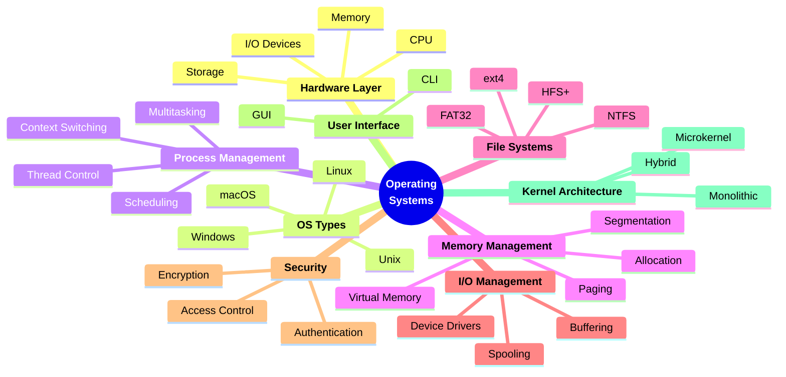

```mermaid
mindmap
  root((<b>Operating<br>Systems</b>))
    <b>Hardware Layer</b>
      CPU
      Memory
      Storage
      I/O Devices
    <b>OS Types</b>
      Windows
      Linux
      macOS
      Unix
    <b>Process Management</b>
      Scheduling
      Multitasking
      Thread Control
      Context Switching
    <b>Memory Management</b>
      Virtual Memory
      Paging
      Segmentation
      Allocation
    <b>File Systems</b>
      NTFS
      ext4
      FAT32
      HFS+
    <b>I/O Management</b>
      Device Drivers
      Buffering
      Spooling
    <b>Security</b>
      Authentication
      Access Control
      Encryption
    <b>User Interface</b>
      GUI
      CLI
    <b>Kernel Architecture</b>
      Monolithic
      Microkernel
      Hybrid
```

