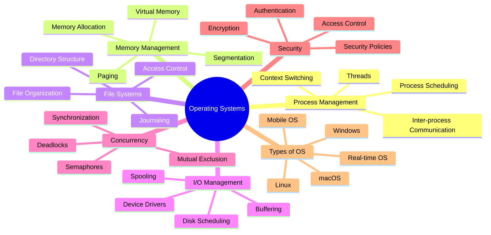

```mermaid
mindmap
  root((Operating Systems))
    Process Management
      Process Scheduling
      Context Switching
      Inter-process Communication
      Threads
    Memory Management
      Virtual Memory
      Paging
      Segmentation
      Memory Allocation
    File Systems
      File Organization
      Directory Structure
      Access Control
      Journaling
    I/O Management
      Device Drivers
      Buffering
      Spooling
      Disk Scheduling
    Concurrency
      Synchronization
      Deadlocks
      Mutual Exclusion
      Semaphores
    Security
      Authentication
      Access Control
      Encryption
      Security Policies
    Types of OS
      Windows
      Linux
      macOS
      Real-time OS
      Mobile OS
```

