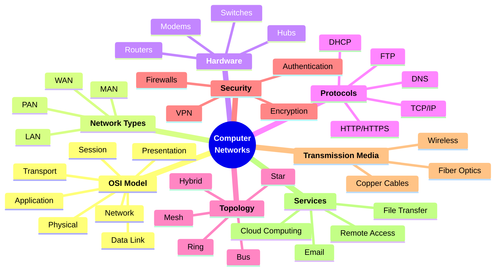

```mermaid
mindmap
  root((<b>Computer<br>Networks</b>))
    <b>OSI Model</b>
      Physical
      Data Link
      Network
      Transport
      Session
      Presentation
      Application
    <b>Network Types</b>
      LAN
      WAN
      MAN
      PAN
    <b>Hardware</b>
      Routers
      Switches
      Hubs
      Modems
    <b>Protocols</b>
      TCP/IP
      HTTP/HTTPS
      FTP
      DNS
      DHCP
    <b>Topology</b>
      Star
      Ring
      Mesh
      Bus
      Hybrid
    <b>Security</b>
      Firewalls
      VPN
      Encryption
      Authentication
    <b>Transmission Media</b>
      Copper Cables
      Fiber Optics
      Wireless
    <b>Services</b>
      Email
      File Transfer
      Remote Access
      Cloud Computing
```

