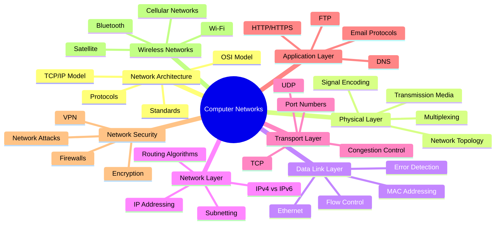

```mermaid
mindmap
  root((Computer Networks))
    Network Architecture
      OSI Model
      TCP/IP Model
      Protocols
      Standards
    Physical Layer
      Transmission Media
      Signal Encoding
      Multiplexing
      Network Topology
    Data Link Layer
      MAC Addressing
      Error Detection
      Flow Control
      Ethernet
    Network Layer
      IP Addressing
      Routing Algorithms
      Subnetting
      IPv4 vs IPv6
    Transport Layer
      TCP
      UDP
      Port Numbers
      Congestion Control
    Application Layer
      HTTP/HTTPS
      FTP
      DNS
      Email Protocols
    Network Security
      Firewalls
      Encryption
      VPN
      Network Attacks
    Wireless Networks
      Wi-Fi
      Bluetooth
      Cellular Networks
      Satellite
```

