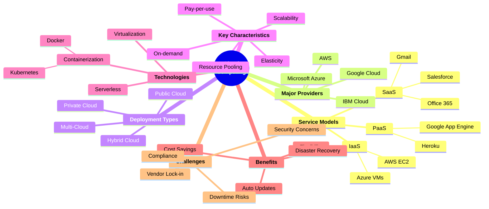

```mermaid
mindmap
  root((<b>Cloud<br>Computing</b>))
    <b>Service Models</b>
      IaaS
        AWS EC2
        Azure VMs
      PaaS
        Google App Engine
        Heroku
      SaaS
        Gmail
        Salesforce
        Office 365
    <b>Major Providers</b>
      AWS
      Microsoft Azure
      Google Cloud
      IBM Cloud
    <b>Deployment Types</b>
      Public Cloud
      Private Cloud
      Hybrid Cloud
      Multi-Cloud
    <b>Key Characteristics</b>
      Elasticity
      Scalability
      Pay-per-use
      Resource Pooling
      On-demand
    <b>Technologies</b>
      Virtualization
      Containerization
        Docker
        Kubernetes
      Serverless
    <b>Benefits</b>
      Cost Savings
      Flexibility
      Disaster Recovery
      Auto Updates
    <b>Challenges</b>
      Security Concerns
      Vendor Lock-in
      Compliance
      Downtime Risks
```

