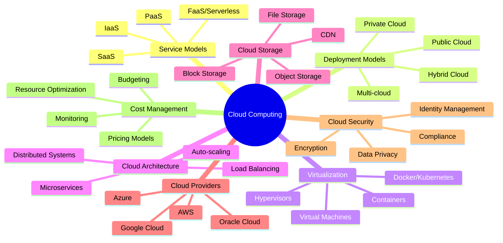

```mermaid
mindmap
  root((Cloud Computing))
    Service Models
      IaaS
      PaaS
      SaaS
      FaaS/Serverless
    Deployment Models
      Public Cloud
      Private Cloud
      Hybrid Cloud
      Multi-cloud
    Virtualization
      Virtual Machines
      Containers
      Hypervisors
      Docker/Kubernetes
    Cloud Architecture
      Microservices
      Load Balancing
      Auto-scaling
      Distributed Systems
    Cloud Storage
      Object Storage
      Block Storage
      File Storage
      CDN
    Cloud Providers
      AWS
      Azure
      Google Cloud
      Oracle Cloud
    Cloud Security
      Identity Management
      Encryption
      Compliance
      Data Privacy
    Cost Management
      Pricing Models
      Resource Optimization
      Monitoring
      Budgeting
```

