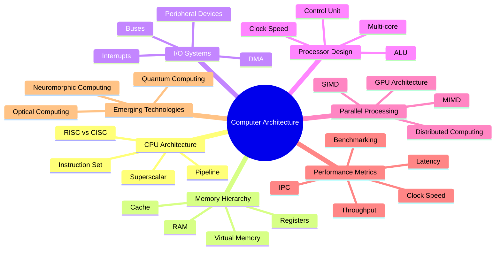

```mermaid
mindmap
  root((Computer Architecture))
    CPU Architecture
      Instruction Set
      Pipeline
      Superscalar
      RISC vs CISC
    Memory Hierarchy
      Registers
      Cache
      RAM
      Virtual Memory
    I/O Systems
      Buses
      Interrupts
      DMA
      Peripheral Devices
    Processor Design
      Control Unit
      ALU
      Clock Speed
      Multi-core
    Parallel Processing
      SIMD
      MIMD
      GPU Architecture
      Distributed Computing
    Performance Metrics
      Clock Speed
      IPC
      Throughput
      Latency
      Benchmarking
    Emerging Technologies
      Quantum Computing
      Neuromorphic Computing
      Optical Computing
```

