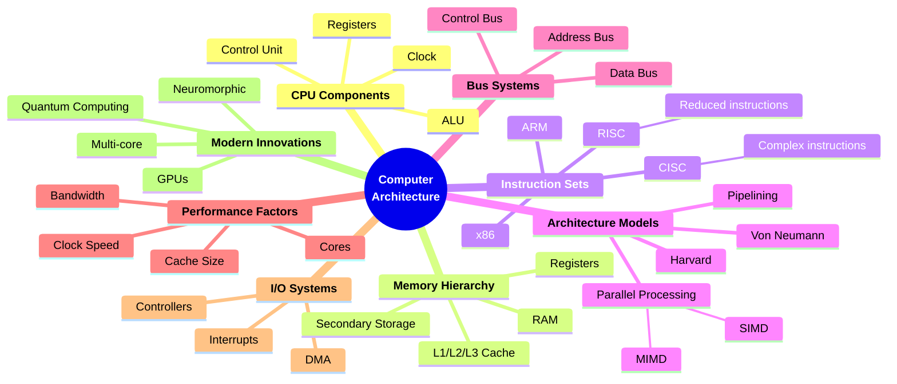

```mermaid
mindmap
  root((<b>Computer<br>Architecture</b>))
    <b>CPU Components</b>
      ALU
      Control Unit
      Registers
      Clock
    <b>Memory Hierarchy</b>
      Registers
      L1/L2/L3 Cache
      RAM
      Secondary Storage
    <b>Instruction Sets</b>
      CISC
        Complex instructions
      RISC
        Reduced instructions
      ARM
      x86
    <b>Architecture Models</b>
      Von Neumann
      Harvard
      Pipelining
      Parallel Processing
        SIMD
        MIMD
    <b>Bus Systems</b>
      Data Bus
      Address Bus
      Control Bus
    <b>Performance Factors</b>
      Clock Speed
      Cores
      Cache Size
      Bandwidth
    <b>I/O Systems</b>
      Interrupts
      DMA
      Controllers
    <b>Modern Innovations</b>
      Multi-core
      GPUs
      Quantum Computing
      Neuromorphic
```

