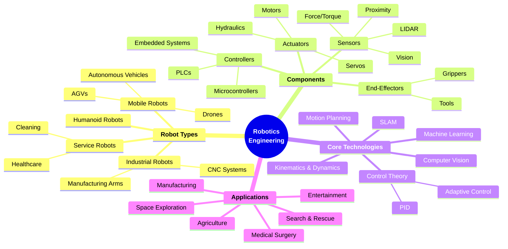

```mermaid
mindmap
  root((<b>Robotics<br>Engineering</b>))
    <b>Robot Types</b>
      Industrial Robots
        Manufacturing Arms
        CNC Systems
      Service Robots
        Cleaning
        Healthcare
      Mobile Robots
        Autonomous Vehicles
        Drones
        AGVs
      Humanoid Robots
    <b>Components</b>
      Actuators
        Motors
        Servos
        Hydraulics
      Sensors
        Vision
        LIDAR
        Proximity
        Force/Torque
      Controllers
        PLCs
        Microcontrollers
        Embedded Systems
      End-Effectors
        Grippers
        Tools
    <b>Core Technologies</b>
      Kinematics & Dynamics
      Control Theory
        PID
        Adaptive Control
      Computer Vision
      Machine Learning
      SLAM
      Motion Planning
    <b>Applications</b>
      Manufacturing
      Medical Surgery
      Space Exploration
      Agriculture
      Search & Rescue
      Entertainment
```

