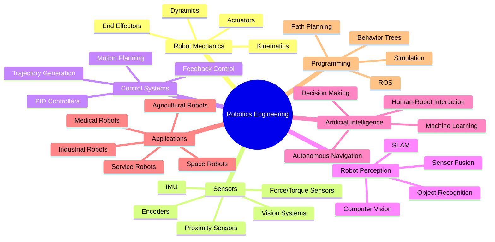

```mermaid
mindmap
  root((Robotics Engineering))
    Robot Mechanics
      Kinematics
      Dynamics
      Actuators
      End Effectors
    Sensors
      Vision Systems
      Proximity Sensors
      Force/Torque Sensors
      Encoders
      IMU
    Control Systems
      Feedback Control
      PID Controllers
      Motion Planning
      Trajectory Generation
    Robot Perception
      Computer Vision
      SLAM
      Object Recognition
      Sensor Fusion
    Artificial Intelligence
      Machine Learning
      Autonomous Navigation
      Decision Making
      Human-Robot Interaction
    Applications
      Industrial Robots
      Service Robots
      Medical Robots
      Agricultural Robots
      Space Robots
    Programming
      ROS
      Simulation
      Path Planning
      Behavior Trees
```

