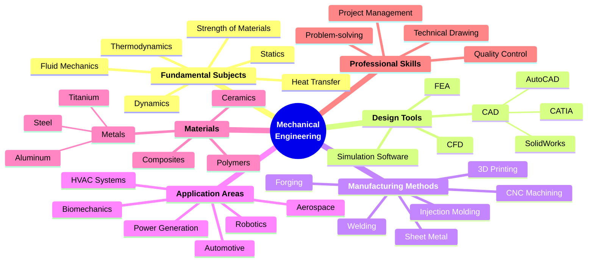

```mermaid
mindmap
  root((<b>Mechanical<br>Engineering</b>))
    <b>Fundamental Subjects</b>
      Statics
      Dynamics
      Fluid Mechanics
      Thermodynamics
      Heat Transfer
      Strength of Materials
    <b>Design Tools</b>
      CAD
        SolidWorks
        AutoCAD
        CATIA
      FEA
      CFD
      Simulation Software
    <b>Manufacturing Methods</b>
      CNC Machining
      3D Printing
      Welding
      Forging
      Injection Molding
      Sheet Metal
    <b>Application Areas</b>
      Automotive
      Aerospace
      HVAC Systems
      Power Generation
      Robotics
      Biomechanics
    <b>Materials</b>
      Metals
        Steel
        Aluminum
        Titanium
      Composites
      Polymers
      Ceramics
    <b>Professional Skills</b>
      Problem-solving
      Project Management
      Technical Drawing
      Quality Control
```

