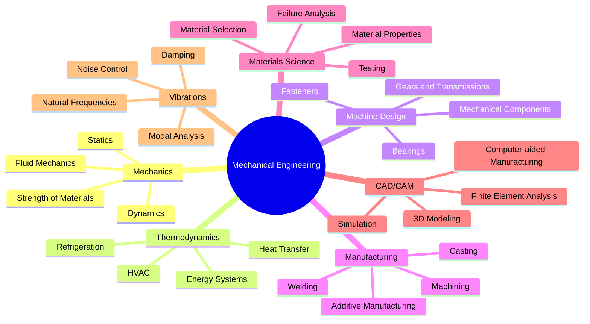

```mermaid
mindmap
  root((Mechanical Engineering))
    Mechanics
      Statics
      Dynamics
      Strength of Materials
      Fluid Mechanics
    Thermodynamics
      Heat Transfer
      Energy Systems
      HVAC
      Refrigeration
    Machine Design
      Gears and Transmissions
      Bearings
      Fasteners
      Mechanical Components
    Manufacturing
      Machining
      Casting
      Welding
      Additive Manufacturing
    Materials Science
      Material Properties
      Material Selection
      Failure Analysis
      Testing
    CAD/CAM
      3D Modeling
      Finite Element Analysis
      Computer-aided Manufacturing
      Simulation
    Vibrations
      Natural Frequencies
      Damping
      Modal Analysis
      Noise Control
```

