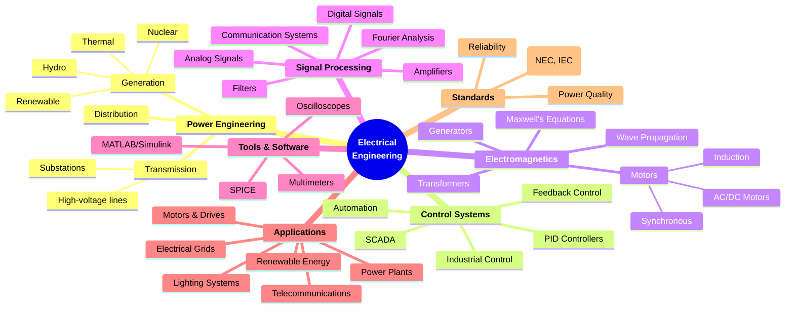

```mermaid
mindmap
  root((<b>Electrical<br>Engineering</b>))
    <b>Power Engineering</b>
      Generation
        Thermal
        Hydro
        Nuclear
        Renewable
      Transmission
        High-voltage lines
        Substations
      Distribution
    <b>Control Systems</b>
      Feedback Control
      Automation
      PID Controllers
      SCADA
      Industrial Control
    <b>Electromagnetics</b>
      Maxwell's Equations
      Wave Propagation
      Motors
        AC/DC Motors
        Induction
        Synchronous
      Generators
      Transformers
    <b>Signal Processing</b>
      Analog Signals
      Digital Signals
      Fourier Analysis
      Filters
      Amplifiers
      Communication Systems
    <b>Tools & Software</b>
      SPICE
      MATLAB/Simulink
      Oscilloscopes
      Multimeters
    <b>Applications</b>
      Power Plants
      Electrical Grids
      Motors & Drives
      Telecommunications
      Lighting Systems
      Renewable Energy
    <b>Standards</b>
      Safety (NEC, IEC)
      Power Quality
      Reliability
```

