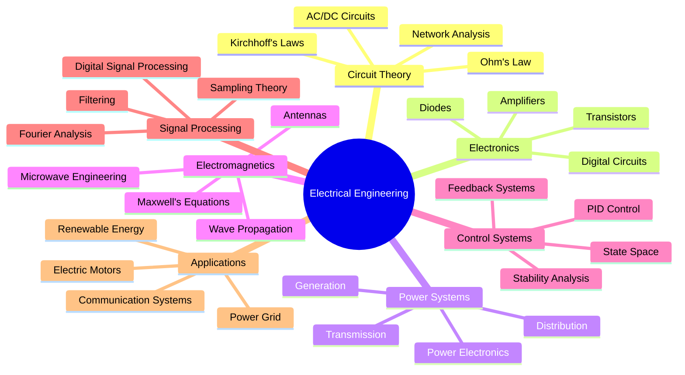

```mermaid
mindmap
  root((Electrical Engineering))
    Circuit Theory
      Ohm's Law
      Kirchhoff's Laws
      AC/DC Circuits
      Network Analysis
    Electronics
      Diodes
      Transistors
      Amplifiers
      Digital Circuits
    Power Systems
      Generation
      Transmission
      Distribution
      Power Electronics
    Electromagnetics
      Maxwell's Equations
      Antennas
      Wave Propagation
      Microwave Engineering
    Control Systems
      Feedback Systems
      PID Control
      State Space
      Stability Analysis
    Signal Processing
      Filtering
      Fourier Analysis
      Digital Signal Processing
      Sampling Theory
    Applications
      Power Grid
      Renewable Energy
      Electric Motors
      Communication Systems
```

