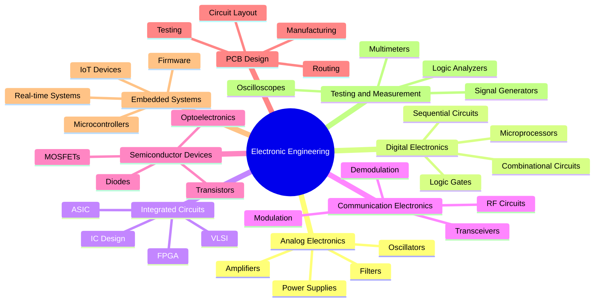

```mermaid
mindmap
  root((Electronic Engineering))
    Analog Electronics
      Amplifiers
      Oscillators
      Filters
      Power Supplies
    Digital Electronics
      Logic Gates
      Combinational Circuits
      Sequential Circuits
      Microprocessors
    Integrated Circuits
      IC Design
      VLSI
      ASIC
      FPGA
    Communication Electronics
      Modulation
      Demodulation
      RF Circuits
      Transceivers
    Semiconductor Devices
      Diodes
      Transistors
      MOSFETs
      Optoelectronics
    PCB Design
      Circuit Layout
      Routing
      Manufacturing
      Testing
    Embedded Systems
      Microcontrollers
      Real-time Systems
      Firmware
      IoT Devices
    Testing and Measurement
      Oscilloscopes
      Signal Generators
      Logic Analyzers
      Multimeters
```

