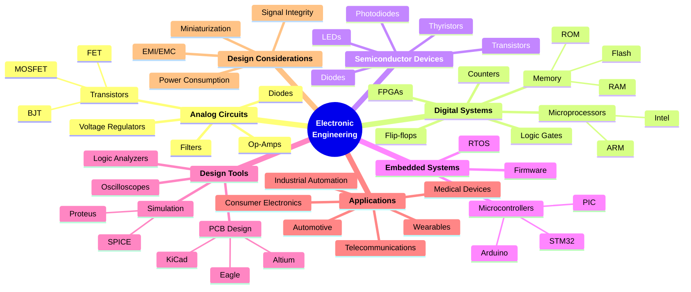

```mermaid
mindmap
  root((<b>Electronic<br>Engineering</b>))
    <b>Analog Circuits</b>
      Op-Amps
      Transistors
        BJT
        FET
        MOSFET
      Diodes
      Voltage Regulators
      Filters
    <b>Digital Systems</b>
      Logic Gates
      Flip-flops
      Counters
      Microprocessors
        Intel
        ARM
      FPGAs
      Memory
        RAM
        ROM
        Flash
    <b>Semiconductor Devices</b>
      Diodes
      Transistors
      LEDs
      Photodiodes
      Thyristors
    <b>Embedded Systems</b>
      Microcontrollers
        Arduino
        PIC
        STM32
      RTOS
      Firmware
    <b>Design Tools</b>
      PCB Design
        Altium
        Eagle
        KiCad
      Simulation
        SPICE
        Proteus
      Oscilloscopes
      Logic Analyzers
    <b>Applications</b>
      Consumer Electronics
      Telecommunications
      Medical Devices
      Automotive
      Industrial Automation
      Wearables
    <b>Design Considerations</b>
      Power Consumption
      Signal Integrity
      EMI/EMC
      Miniaturization
```

