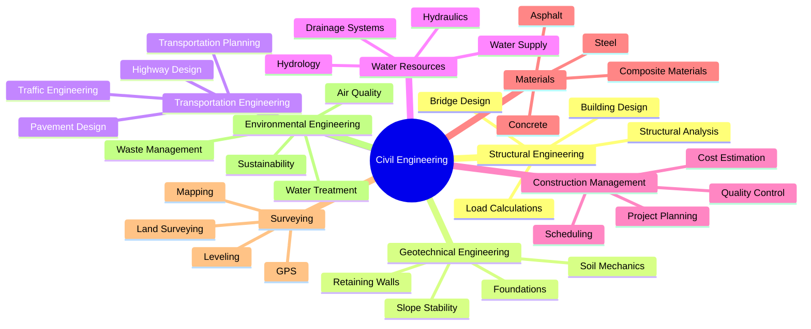

```mermaid
mindmap
  root((Civil Engineering))
    Structural Engineering
      Building Design
      Bridge Design
      Structural Analysis
      Load Calculations
    Geotechnical Engineering
      Soil Mechanics
      Foundations
      Slope Stability
      Retaining Walls
    Transportation Engineering
      Highway Design
      Traffic Engineering
      Pavement Design
      Transportation Planning
    Water Resources
      Hydrology
      Hydraulics
      Drainage Systems
      Water Supply
    Construction Management
      Project Planning
      Scheduling
      Cost Estimation
      Quality Control
    Materials
      Concrete
      Steel
      Asphalt
      Composite Materials
    Surveying
      Land Surveying
      GPS
      Leveling
      Mapping
    Environmental Engineering
      Waste Management
      Water Treatment
      Air Quality
      Sustainability
```

