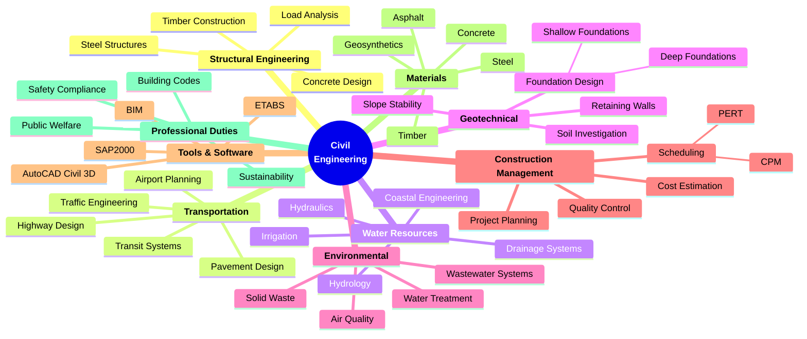

```mermaid
mindmap
  root((<b>Civil<br>Engineering</b>))
    <b>Structural Engineering</b>
      Steel Structures
      Concrete Design
      Timber Construction
      Load Analysis
    <b>Transportation</b>
      Highway Design
      Traffic Engineering
      Pavement Design
      Transit Systems
      Airport Planning
    <b>Water Resources</b>
      Hydraulics
      Hydrology
      Drainage Systems
      Irrigation
      Coastal Engineering
    <b>Geotechnical</b>
      Soil Investigation
      Foundation Design
        Shallow Foundations
        Deep Foundations
      Retaining Walls
      Slope Stability
    <b>Environmental</b>
      Water Treatment
      Wastewater Systems
      Solid Waste
      Air Quality
    <b>Construction Management</b>
      Project Planning
      Scheduling
        CPM
        PERT
      Cost Estimation
      Quality Control
    <b>Tools & Software</b>
      AutoCAD Civil 3D
      SAP2000
      ETABS
      BIM
    <b>Materials</b>
      Concrete
      Steel
      Asphalt
      Timber
      Geosynthetics
    <b>Professional Duties</b>
      Safety Compliance
      Building Codes
      Sustainability
      Public Welfare
```

