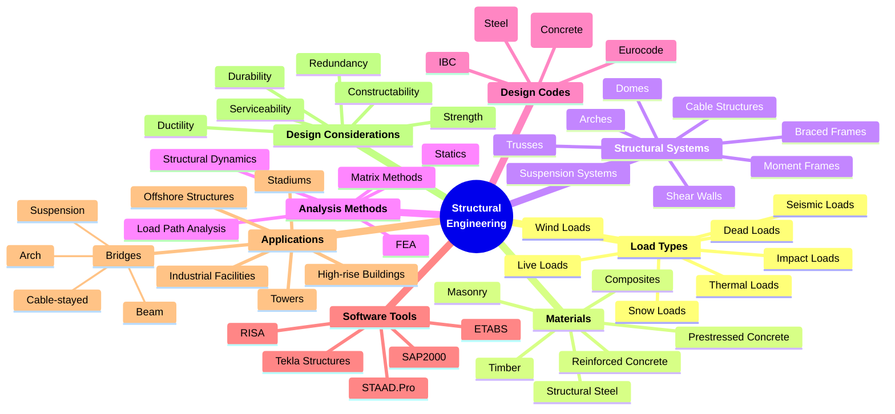

```mermaid
mindmap
  root((<b>Structural<br>Engineering</b>))
    <b>Load Types</b>
      Dead Loads
      Live Loads
      Wind Loads
      Seismic Loads
      Snow Loads
      Impact Loads
      Thermal Loads
    <b>Materials</b>
      Reinforced Concrete
      Structural Steel
      Prestressed Concrete
      Timber
      Masonry
      Composites
    <b>Structural Systems</b>
      Moment Frames
      Braced Frames
      Shear Walls
      Trusses
      Arches
      Domes
      Suspension Systems
      Cable Structures
    <b>Analysis Methods</b>
      Statics
      Structural Dynamics
      FEA
      Matrix Methods
      Load Path Analysis
    <b>Design Codes</b>
      ACI (Concrete)
      AISC (Steel)
      IBC
      Eurocode
    <b>Software Tools</b>
      SAP2000
      ETABS
      STAAD.Pro
      RISA
      Tekla Structures
    <b>Applications</b>
      High-rise Buildings
      Bridges
        Beam
        Arch
        Suspension
        Cable-stayed
      Stadiums
      Towers
      Industrial Facilities
      Offshore Structures
    <b>Design Considerations</b>
      Strength
      Serviceability
      Ductility
      Redundancy
      Durability
      Constructability
```

