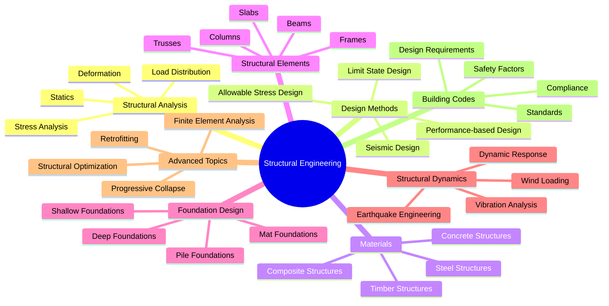

```mermaid
mindmap
  root((Structural Engineering))
    Structural Analysis
      Statics
      Load Distribution
      Stress Analysis
      Deformation
    Design Methods
      Limit State Design
      Allowable Stress Design
      Performance-based Design
      Seismic Design
    Materials
      Steel Structures
      Concrete Structures
      Timber Structures
      Composite Structures
    Structural Elements
      Beams
      Columns
      Slabs
      Trusses
      Frames
    Foundation Design
      Shallow Foundations
      Deep Foundations
      Mat Foundations
      Pile Foundations
    Structural Dynamics
      Earthquake Engineering
      Wind Loading
      Vibration Analysis
      Dynamic Response
    Advanced Topics
      Finite Element Analysis
      Structural Optimization
      Progressive Collapse
      Retrofitting
    Building Codes
      Standards
      Safety Factors
      Design Requirements
      Compliance
```

