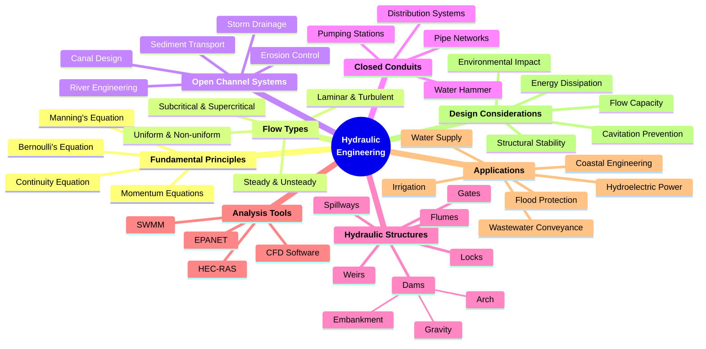

```mermaid
mindmap
  root((<b>Hydraulic<br>Engineering</b>))
    <b>Fundamental Principles</b>
      Continuity Equation
      Bernoulli's Equation
      Manning's Equation
      Momentum Equations
    <b>Flow Types</b>
      Laminar & Turbulent
      Steady & Unsteady
      Uniform & Non-uniform
      Subcritical & Supercritical
    <b>Open Channel Systems</b>
      River Engineering
      Canal Design
      Storm Drainage
      Sediment Transport
      Erosion Control
    <b>Closed Conduits</b>
      Pipe Networks
      Pumping Stations
      Water Hammer
      Distribution Systems
    <b>Hydraulic Structures</b>
      Dams
        Gravity
        Arch
        Embankment
      Spillways
      Gates
      Weirs
      Flumes
      Locks
    <b>Analysis Tools</b>
      HEC-RAS
      SWMM
      EPANET
      CFD Software
    <b>Applications</b>
      Water Supply
      Irrigation
      Flood Protection
      Hydroelectric Power
      Wastewater Conveyance
      Coastal Engineering
    <b>Design Considerations</b>
      Flow Capacity
      Energy Dissipation
      Cavitation Prevention
      Structural Stability
      Environmental Impact
```

