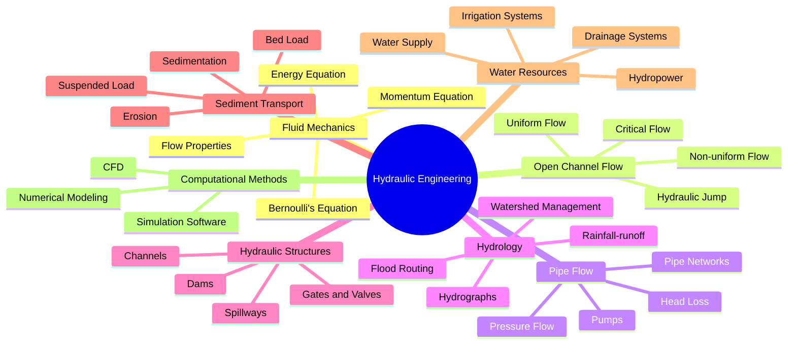

```mermaid
mindmap
  root((Hydraulic Engineering))
    Fluid Mechanics
      Flow Properties
      Bernoulli's Equation
      Momentum Equation
      Energy Equation
    Open Channel Flow
      Uniform Flow
      Non-uniform Flow
      Critical Flow
      Hydraulic Jump
    Pipe Flow
      Pressure Flow
      Head Loss
      Pipe Networks
      Pumps
    Hydrology
      Rainfall-runoff
      Hydrographs
      Flood Routing
      Watershed Management
    Hydraulic Structures
      Dams
      Spillways
      Gates and Valves
      Channels
    Sediment Transport
      Erosion
      Sedimentation
      Bed Load
      Suspended Load
    Water Resources
      Irrigation Systems
      Drainage Systems
      Water Supply
      Hydropower
    Computational Methods
      CFD
      Numerical Modeling
      Simulation Software
```

