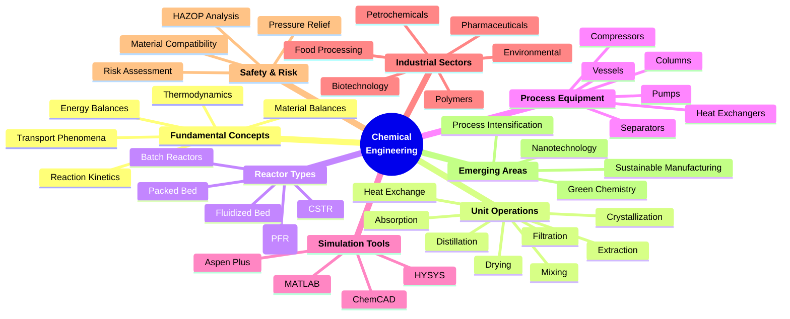

```mermaid
mindmap
  root((<b>Chemical<br>Engineering</b>))
    <b>Fundamental Concepts</b>
      Material Balances
      Energy Balances
      Thermodynamics
      Reaction Kinetics
      Transport Phenomena
    <b>Unit Operations</b>
      Distillation
      Absorption
      Extraction
      Crystallization
      Filtration
      Drying
      Mixing
      Heat Exchange
    <b>Reactor Types</b>
      Batch Reactors
      CSTR
      Plug Flow (PFR)
      Packed Bed
      Fluidized Bed
    <b>Process Equipment</b>
      Heat Exchangers
      Pumps
      Compressors
      Separators
      Columns
      Vessels
    <b>Simulation Tools</b>
      Aspen Plus
      HYSYS
      MATLAB
      ChemCAD
    <b>Industrial Sectors</b>
      Petrochemicals
      Pharmaceuticals
      Polymers
      Food Processing
      Biotechnology
      Environmental
    <b>Safety & Risk</b>
      HAZOP Analysis
      Risk Assessment
      Pressure Relief
      Material Compatibility
    <b>Emerging Areas</b>
      Green Chemistry
      Process Intensification
      Nanotechnology
      Sustainable Manufacturing
```

