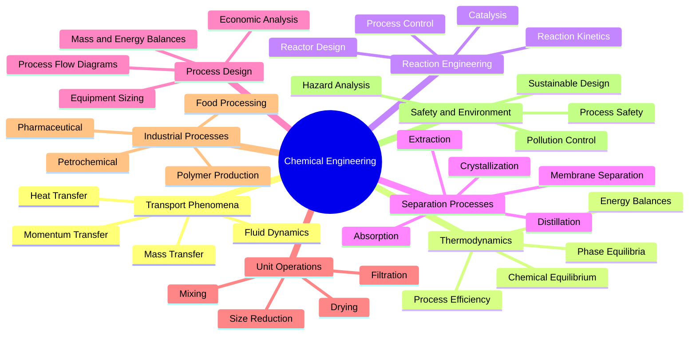

```mermaid
mindmap
  root((Chemical Engineering))
    Transport Phenomena
      Fluid Dynamics
      Heat Transfer
      Mass Transfer
      Momentum Transfer
    Thermodynamics
      Phase Equilibria
      Chemical Equilibrium
      Energy Balances
      Process Efficiency
    Reaction Engineering
      Reaction Kinetics
      Reactor Design
      Catalysis
      Process Control
    Separation Processes
      Distillation
      Extraction
      Absorption
      Crystallization
      Membrane Separation
    Process Design
      Process Flow Diagrams
      Mass and Energy Balances
      Equipment Sizing
      Economic Analysis
    Unit Operations
      Mixing
      Filtration
      Drying
      Size Reduction
    Industrial Processes
      Petrochemical
      Pharmaceutical
      Food Processing
      Polymer Production
    Safety and Environment
      Process Safety
      Hazard Analysis
      Pollution Control
      Sustainable Design
```

