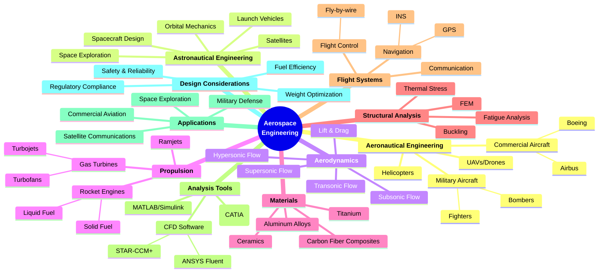

```mermaid
mindmap
  root((<b>Aerospace<br>Engineering</b>))
    <b>Aeronautical Engineering</b>
      Commercial Aircraft
        Boeing
        Airbus
      Military Aircraft
        Fighters
        Bombers
      Helicopters
      UAVs/Drones
    <b>Astronautical Engineering</b>
      Spacecraft Design
      Satellites
      Launch Vehicles
      Orbital Mechanics
      Space Exploration
    <b>Aerodynamics</b>
      Subsonic Flow
      Transonic Flow
      Supersonic Flow
      Hypersonic Flow
      Lift & Drag
    <b>Propulsion</b>
      Gas Turbines
        Turbojets
        Turbofans
      Ramjets
      Rocket Engines
        Solid Fuel
        Liquid Fuel
    <b>Materials</b>
      Aluminum Alloys
      Titanium
      Carbon Fiber Composites
      Ceramics
    <b>Structural Analysis</b>
      FEM
      Fatigue Analysis
      Buckling
      Thermal Stress
    <b>Flight Systems</b>
      Flight Control
        Fly-by-wire
      Navigation
        GPS
        INS
      Communication
    <b>Analysis Tools</b>
      CFD Software
        ANSYS Fluent
        STAR-CCM+
      CAD (CATIA)
      MATLAB/Simulink
    <b>Applications</b>
      Commercial Aviation
      Space Exploration
      Military Defense
      Satellite Communications
    <b>Design Considerations</b>
      Weight Optimization
      Fuel Efficiency
      Safety & Reliability
      Regulatory Compliance
```

