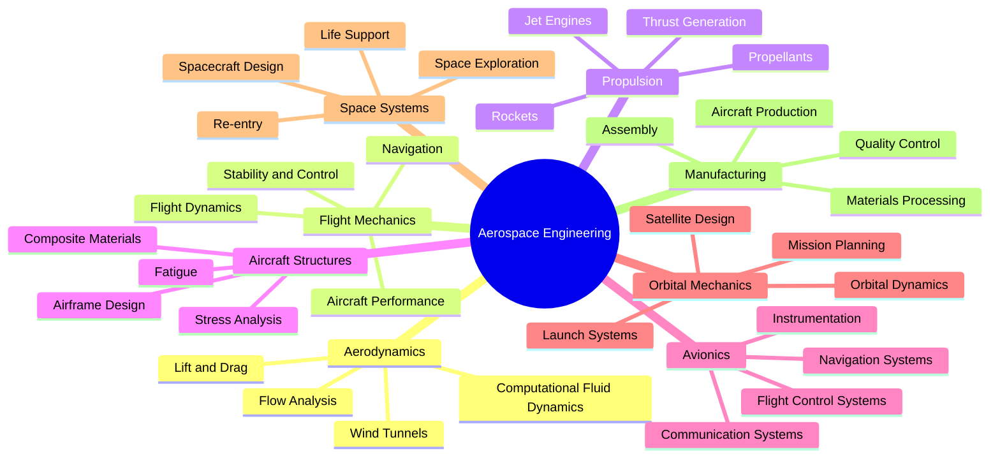

```mermaid
mindmap
  root((Aerospace Engineering))
    Aerodynamics
      Lift and Drag
      Flow Analysis
      Wind Tunnels
      Computational Fluid Dynamics
    Flight Mechanics
      Aircraft Performance
      Stability and Control
      Flight Dynamics
      Navigation
    Propulsion
      Jet Engines
      Rockets
      Propellants
      Thrust Generation
    Aircraft Structures
      Airframe Design
      Composite Materials
      Stress Analysis
      Fatigue
    Avionics
      Flight Control Systems
      Navigation Systems
      Communication Systems
      Instrumentation
    Orbital Mechanics
      Orbital Dynamics
      Satellite Design
      Launch Systems
      Mission Planning
    Space Systems
      Spacecraft Design
      Life Support
      Re-entry
      Space Exploration
    Manufacturing
      Aircraft Production
      Quality Control
      Materials Processing
      Assembly
```

