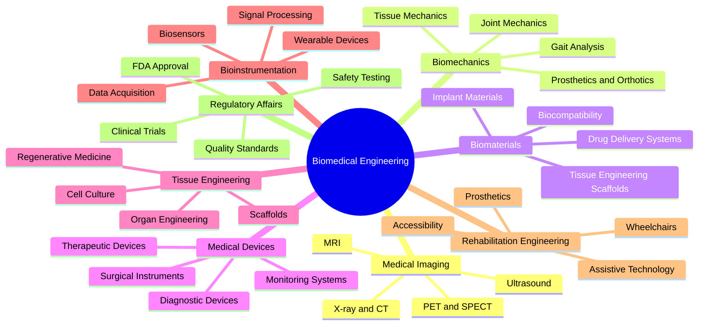

```mermaid
mindmap
  root((Biomedical Engineering))
    Medical Imaging
      X-ray and CT
      MRI
      Ultrasound
      PET and SPECT
    Biomechanics
      Tissue Mechanics
      Joint Mechanics
      Gait Analysis
      Prosthetics and Orthotics
    Biomaterials
      Biocompatibility
      Implant Materials
      Tissue Engineering Scaffolds
      Drug Delivery Systems
    Medical Devices
      Diagnostic Devices
      Therapeutic Devices
      Surgical Instruments
      Monitoring Systems
    Tissue Engineering
      Cell Culture
      Scaffolds
      Regenerative Medicine
      Organ Engineering
    Bioinstrumentation
      Biosensors
      Signal Processing
      Data Acquisition
      Wearable Devices
    Rehabilitation Engineering
      Assistive Technology
      Prosthetics
      Wheelchairs
      Accessibility
    Regulatory Affairs
      FDA Approval
      Clinical Trials
      Quality Standards
      Safety Testing
```

