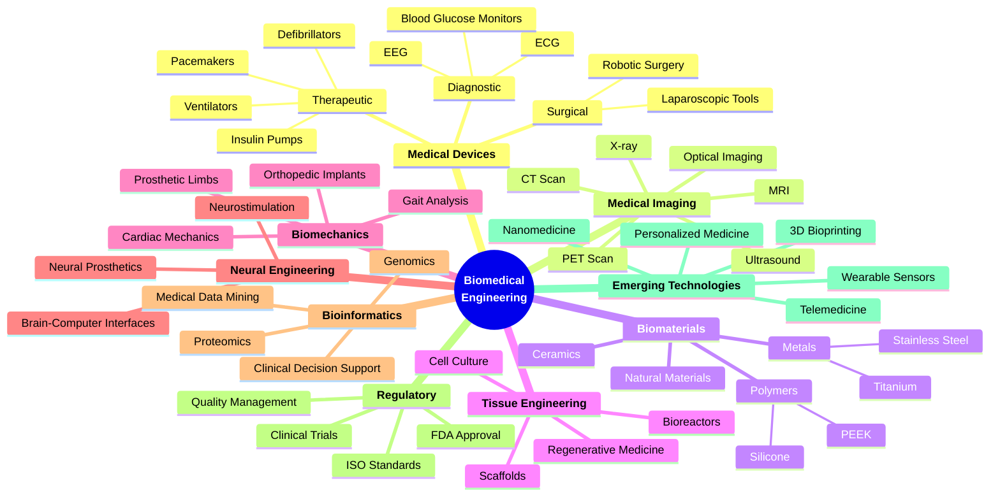

```mermaid
mindmap
  root((<b>Biomedical<br>Engineering</b>))
    <b>Medical Devices</b>
      Diagnostic
        ECG
        EEG
        Blood Glucose Monitors
      Therapeutic
        Pacemakers
        Defibrillators
        Insulin Pumps
        Ventilators
      Surgical
        Robotic Surgery
        Laparoscopic Tools
    <b>Medical Imaging</b>
      X-ray
      CT Scan
      MRI
      Ultrasound
      PET Scan
      Optical Imaging
    <b>Biomaterials</b>
      Metals
        Titanium
        Stainless Steel
      Polymers
        PEEK
        Silicone
      Ceramics
      Natural Materials
    <b>Tissue Engineering</b>
      Cell Culture
      Scaffolds
      Bioreactors
      Regenerative Medicine
    <b>Biomechanics</b>
      Gait Analysis
      Prosthetic Limbs
      Orthopedic Implants
      Cardiac Mechanics
    <b>Neural Engineering</b>
      Brain-Computer Interfaces
      Neural Prosthetics
      Neurostimulation
    <b>Bioinformatics</b>
      Genomics
      Proteomics
      Medical Data Mining
      Clinical Decision Support
    <b>Regulatory</b>
      FDA Approval
      ISO Standards
      Clinical Trials
      Quality Management
    <b>Emerging Technologies</b>
      Nanomedicine
      3D Bioprinting
      Wearable Sensors
      Telemedicine
      Personalized Medicine
```

