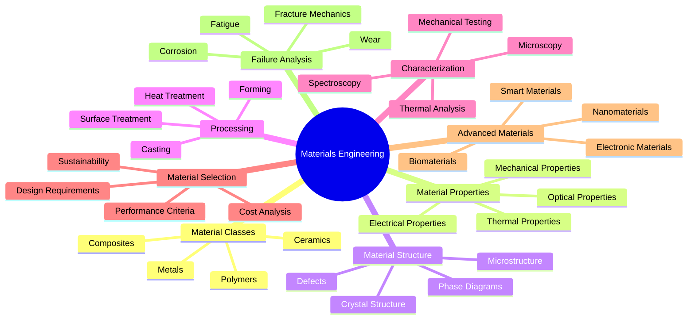

```mermaid
mindmap
  root((Materials Engineering))
    Material Classes
      Metals
      Ceramics
      Polymers
      Composites
    Material Properties
      Mechanical Properties
      Thermal Properties
      Electrical Properties
      Optical Properties
    Material Structure
      Crystal Structure
      Microstructure
      Phase Diagrams
      Defects
    Processing
      Casting
      Forming
      Heat Treatment
      Surface Treatment
    Characterization
      Microscopy
      Spectroscopy
      Mechanical Testing
      Thermal Analysis
    Material Selection
      Design Requirements
      Performance Criteria
      Cost Analysis
      Sustainability
    Advanced Materials
      Nanomaterials
      Smart Materials
      Biomaterials
      Electronic Materials
    Failure Analysis
      Fracture Mechanics
      Fatigue
      Corrosion
      Wear
```

