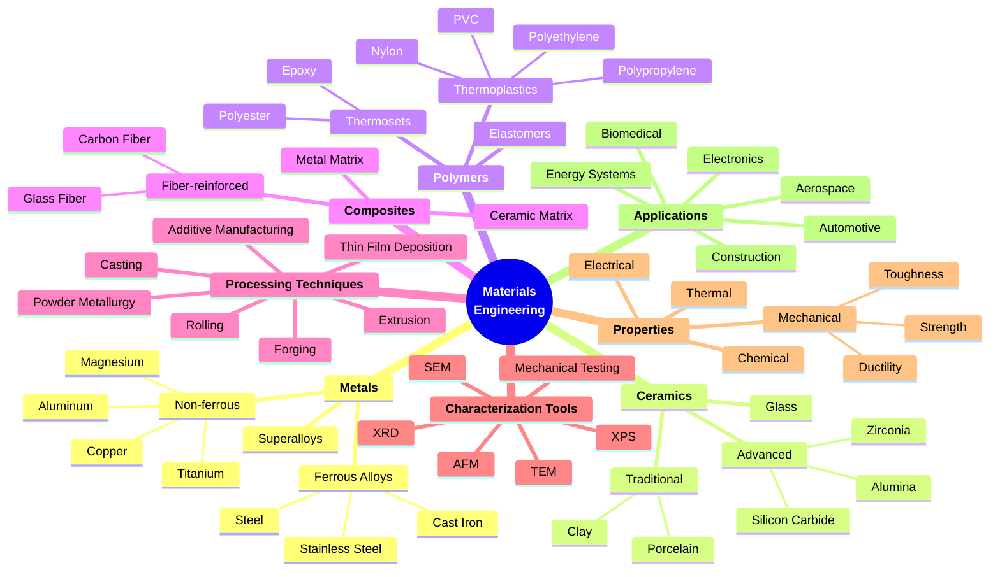

```mermaid
mindmap
  root((<b>Materials<br>Engineering</b>))
    <b>Metals</b>
      Ferrous Alloys
        Steel
        Cast Iron
        Stainless Steel
      Non-ferrous
        Aluminum
        Titanium
        Copper
        Magnesium
      Superalloys
    <b>Ceramics</b>
      Traditional
        Clay
        Porcelain
      Advanced
        Alumina
        Silicon Carbide
        Zirconia
      Glass
    <b>Polymers</b>
      Thermoplastics
        Polyethylene
        Polypropylene
        PVC
        Nylon
      Thermosets
        Epoxy
        Polyester
      Elastomers
    <b>Composites</b>
      Fiber-reinforced
        Carbon Fiber
        Glass Fiber
      Metal Matrix
      Ceramic Matrix
    <b>Processing Techniques</b>
      Casting
      Forging
      Rolling
      Extrusion
      Powder Metallurgy
      Additive Manufacturing
      Thin Film Deposition
    <b>Characterization Tools</b>
      SEM
      TEM
      XRD
      XPS
      AFM
      Mechanical Testing
    <b>Properties</b>
      Mechanical
        Strength
        Ductility
        Toughness
      Thermal
      Electrical
      Chemical
    <b>Applications</b>
      Aerospace
      Automotive
      Electronics
      Energy Systems
      Biomedical
      Construction
```

