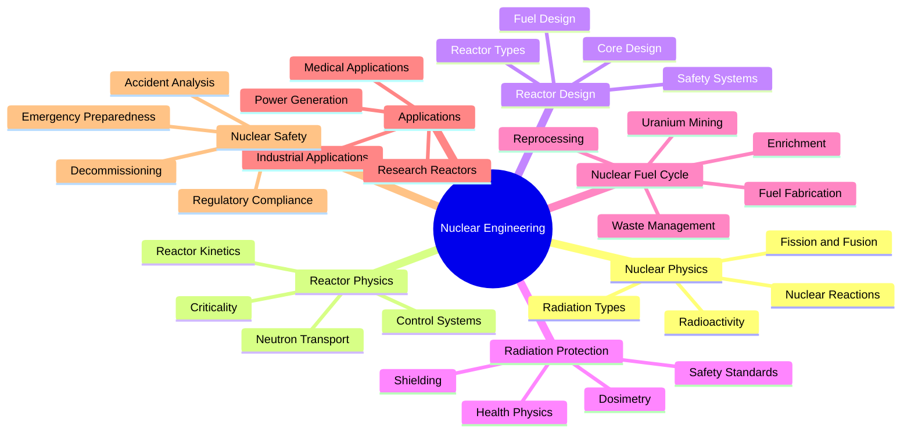

```mermaid
mindmap
  root((Nuclear Engineering))
    Nuclear Physics
      Radioactivity
      Nuclear Reactions
      Fission and Fusion
      Radiation Types
    Reactor Physics
      Neutron Transport
      Criticality
      Reactor Kinetics
      Control Systems
    Reactor Design
      Reactor Types
      Core Design
      Fuel Design
      Safety Systems
    Radiation Protection
      Shielding
      Dosimetry
      Safety Standards
      Health Physics
    Nuclear Fuel Cycle
      Uranium Mining
      Enrichment
      Fuel Fabrication
      Reprocessing
      Waste Management
    Applications
      Power Generation
      Medical Applications
      Industrial Applications
      Research Reactors
    Nuclear Safety
      Accident Analysis
      Emergency Preparedness
      Regulatory Compliance
      Decommissioning
```

