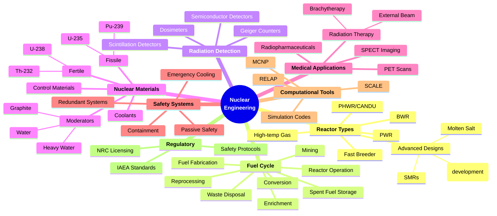

```mermaid
mindmap
  root((<b>Nuclear<br>Engineering</b>))
    <b>Reactor Types</b>
      PWR
      BWR
      PHWR/CANDU
      Fast Breeder
      High-temp Gas
      Advanced Designs
        SMRs
        Molten Salt
        Fusion (development)
    <b>Fuel Cycle</b>
      Mining
      Conversion
      Enrichment
      Fuel Fabrication
      Reactor Operation
      Spent Fuel Storage
      Reprocessing
      Waste Disposal
    <b>Radiation Detection</b>
      Geiger Counters
      Scintillation Detectors
      Semiconductor Detectors
      Dosimeters
    <b>Nuclear Materials</b>
      Fissile
        U-235
        Pu-239
      Fertile
        U-238
        Th-232
      Moderators
        Water
        Heavy Water
        Graphite
      Coolants
      Control Materials
    <b>Medical Applications</b>
      PET Scans
      SPECT Imaging
      Radiation Therapy
        External Beam
        Brachytherapy
      Radiopharmaceuticals
    <b>Safety Systems</b>
      Containment
      Emergency Cooling
      Redundant Systems
      Passive Safety
    <b>Computational Tools</b>
      MCNP
      RELAP
      SCALE
      Simulation Codes
    <b>Regulatory</b>
      NRC Licensing
      IAEA Standards
      Safety Protocols
```

