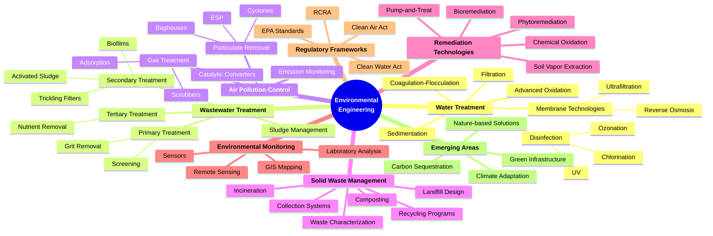

```mermaid
mindmap
  root((<b>Environmental<br>Engineering</b>))
    <b>Water Treatment</b>
      Coagulation-Flocculation
      Sedimentation
      Filtration
      Disinfection
        Chlorination
        UV
        Ozonation
      Membrane Technologies
        Reverse Osmosis
        Ultrafiltration
      Advanced Oxidation
    <b>Wastewater Treatment</b>
      Primary Treatment
        Screening
        Grit Removal
      Secondary Treatment
        Activated Sludge
        Trickling Filters
        Biofilms
      Tertiary Treatment
        Nutrient Removal
      Sludge Management
    <b>Air Pollution Control</b>
      Particulate Removal
        Cyclones
        ESP
        Baghouses
      Gas Treatment
        Scrubbers
        Catalytic Converters
        Adsorption
      Emission Monitoring
    <b>Solid Waste Management</b>
      Waste Characterization
      Collection Systems
      Landfill Design
      Incineration
      Composting
      Recycling Programs
    <b>Remediation Technologies</b>
      Soil Vapor Extraction
      Bioremediation
      Phytoremediation
      Pump-and-Treat
      Chemical Oxidation
    <b>Environmental Monitoring</b>
      Sensors
      GIS Mapping
      Remote Sensing
      Laboratory Analysis
    <b>Regulatory Frameworks</b>
      EPA Standards
      Clean Water Act
      Clean Air Act
      RCRA
    <b>Emerging Areas</b>
      Green Infrastructure
      Climate Adaptation
      Carbon Sequestration
      Nature-based Solutions
```

