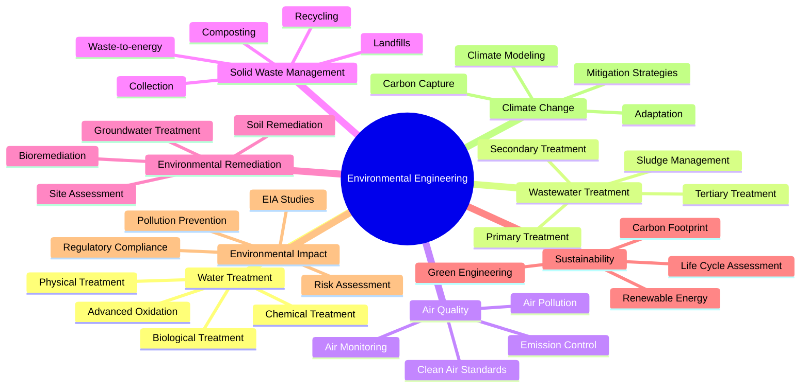

```mermaid
mindmap
  root((Environmental Engineering))
    Water Treatment
      Physical Treatment
      Chemical Treatment
      Biological Treatment
      Advanced Oxidation
    Wastewater Treatment
      Primary Treatment
      Secondary Treatment
      Tertiary Treatment
      Sludge Management
    Air Quality
      Air Pollution
      Emission Control
      Air Monitoring
      Clean Air Standards
    Solid Waste Management
      Collection
      Recycling
      Composting
      Landfills
      Waste-to-energy
    Environmental Remediation
      Soil Remediation
      Groundwater Treatment
      Site Assessment
      Bioremediation
    Sustainability
      Green Engineering
      Life Cycle Assessment
      Carbon Footprint
      Renewable Energy
    Environmental Impact
      EIA Studies
      Risk Assessment
      Regulatory Compliance
      Pollution Prevention
    Climate Change
      Mitigation Strategies
      Adaptation
      Carbon Capture
      Climate Modeling
```

