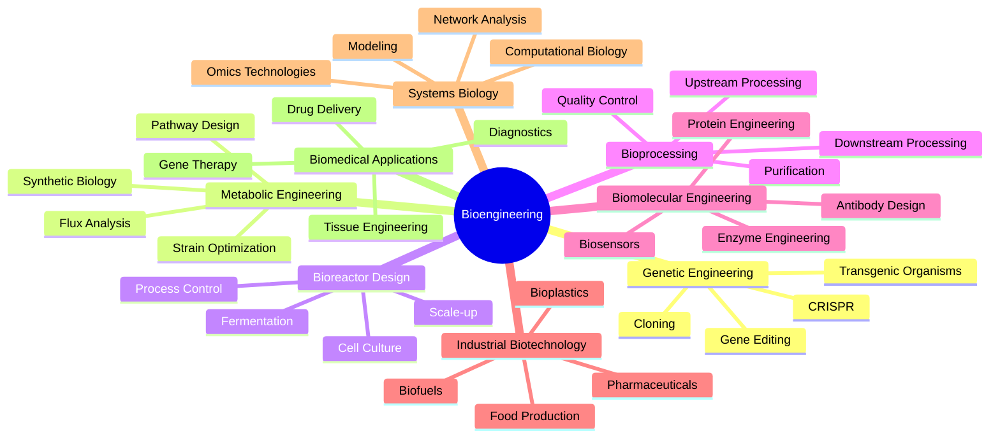

```mermaid
mindmap
  root((Bioengineering))
    Genetic Engineering
      Gene Editing
      CRISPR
      Cloning
      Transgenic Organisms
    Metabolic Engineering
      Pathway Design
      Flux Analysis
      Strain Optimization
      Synthetic Biology
    Bioreactor Design
      Cell Culture
      Fermentation
      Scale-up
      Process Control
    Bioprocessing
      Upstream Processing
      Downstream Processing
      Purification
      Quality Control
    Biomolecular Engineering
      Protein Engineering
      Enzyme Engineering
      Antibody Design
      Biosensors
    Industrial Biotechnology
      Biofuels
      Bioplastics
      Pharmaceuticals
      Food Production
    Systems Biology
      Modeling
      Network Analysis
      Omics Technologies
      Computational Biology
    Biomedical Applications
      Drug Delivery
      Gene Therapy
      Tissue Engineering
      Diagnostics
```

