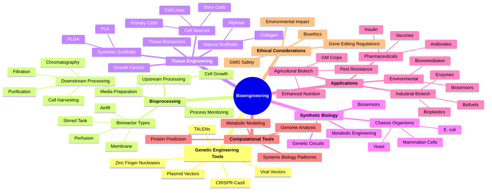

```mermaid
mindmap
  root((<b>Bioengineering</b>))
    <b>Genetic Engineering Tools</b>
      CRISPR-Cas9
      TALENs
      Zinc Finger Nucleases
      Plasmid Vectors
      Viral Vectors
    <b>Bioprocessing</b>
      Upstream Processing
        Media Preparation
        Cell Growth
      Bioreactor Types
        Stirred Tank
        Airlift
        Membrane
        Perfusion
      Downstream Processing
        Cell Harvesting
        Purification
        Chromatography
        Filtration
      Process Monitoring
    <b>Tissue Engineering</b>
      Natural Scaffolds
        Collagen
        Alginate
      Synthetic Scaffolds
        PLA
        PLGA
      Cell Sources
        Stem Cells
        Primary Cells
        Cell Lines
      Growth Factors
      Tissue Bioreactors
    <b>Synthetic Biology</b>
      Genetic Circuits
      Biosensors
      Metabolic Engineering
      Chassis Organisms
        E. coli
        Yeast
        Mammalian Cells
    <b>Applications</b>
      Pharmaceuticals
        Insulin
        Antibodies
        Vaccines
      Agricultural Biotech
        GM Crops
        Pest Resistance
        Enhanced Nutrition
      Industrial Biotech
        Biofuels
        Bioplastics
        Enzymes
      Environmental
        Bioremediation
        Biosensors
    <b>Computational Tools</b>
      Genome Analysis
      Protein Prediction
      Metabolic Modeling
      Systems Biology Platforms
    <b>Ethical Considerations</b>
      GMO Safety
      Gene Editing Regulations
      Bioethics
      Environmental Impact
```

