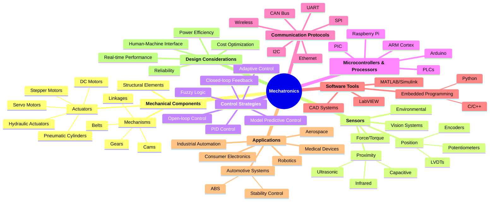

```mermaid
mindmap
  root((<b>Mechatronics</b>))
    <b>Mechanical Components</b>
      Actuators
        DC Motors
        Stepper Motors
        Servo Motors
        Pneumatic Cylinders
        Hydraulic Actuators
      Mechanisms
        Gears
        Linkages
        Cams
        Belts
      Structural Elements
    <b>Sensors</b>
      Position
        Encoders
        Potentiometers
        LVDTs
      Force/Torque
      Proximity
        Ultrasonic
        Infrared
        Capacitive
      Vision Systems
      Environmental
    <b>Control Strategies</b>
      Open-loop Control
      Closed-loop Feedback
      PID Control
      Adaptive Control
      Fuzzy Logic
      Model Predictive Control
    <b>Microcontrollers & Processors</b>
      Arduino
      Raspberry Pi
      PIC
      ARM Cortex
      PLCs
    <b>Communication Protocols</b>
      I2C
      SPI
      UART
      CAN Bus
      Ethernet
      Wireless
    <b>Software Tools</b>
      MATLAB/Simulink
      LabVIEW
      CAD Systems
      Embedded Programming
        C/C++
        Python
    <b>Applications</b>
      Industrial Automation
      Robotics
      Automotive Systems
        ABS
        Stability Control
      Consumer Electronics
      Aerospace
      Medical Devices
    <b>Design Considerations</b>
      Real-time Performance
      Reliability
      Cost Optimization
      Power Efficiency
      Human-Machine Interface
```

