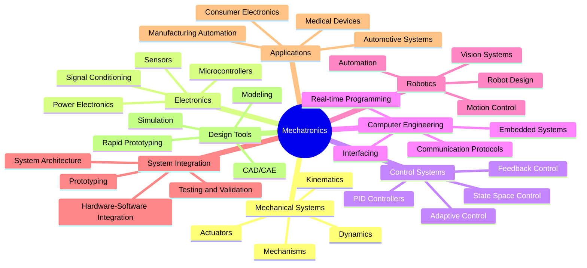

```mermaid
mindmap
  root((Mechatronics))
    Mechanical Systems
      Kinematics
      Dynamics
      Actuators
      Mechanisms
    Electronics
      Microcontrollers
      Sensors
      Power Electronics
      Signal Conditioning
    Control Systems
      Feedback Control
      PID Controllers
      State Space Control
      Adaptive Control
    Computer Engineering
      Embedded Systems
      Real-time Programming
      Interfacing
      Communication Protocols
    Robotics
      Robot Design
      Motion Control
      Vision Systems
      Automation
    System Integration
      Hardware-Software Integration
      System Architecture
      Testing and Validation
      Prototyping
    Applications
      Manufacturing Automation
      Automotive Systems
      Consumer Electronics
      Medical Devices
    Design Tools
      CAD/CAE
      Simulation
      Modeling
      Rapid Prototyping
```

