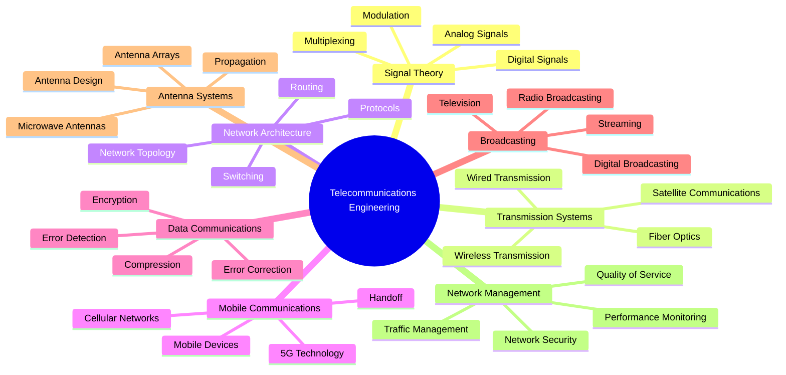

```mermaid
mindmap
  root((Telecommunications Engineering))
    Signal Theory
      Analog Signals
      Digital Signals
      Modulation
      Multiplexing
    Transmission Systems
      Wired Transmission
      Wireless Transmission
      Fiber Optics
      Satellite Communications
    Network Architecture
      Network Topology
      Protocols
      Switching
      Routing
    Mobile Communications
      Cellular Networks
      5G Technology
      Mobile Devices
      Handoff
    Data Communications
      Error Detection
      Error Correction
      Compression
      Encryption
    Broadcasting
      Radio Broadcasting
      Television
      Digital Broadcasting
      Streaming
    Antenna Systems
      Antenna Design
      Propagation
      Antenna Arrays
      Microwave Antennas
    Network Management
      Performance Monitoring
      Quality of Service
      Traffic Management
      Network Security
```

