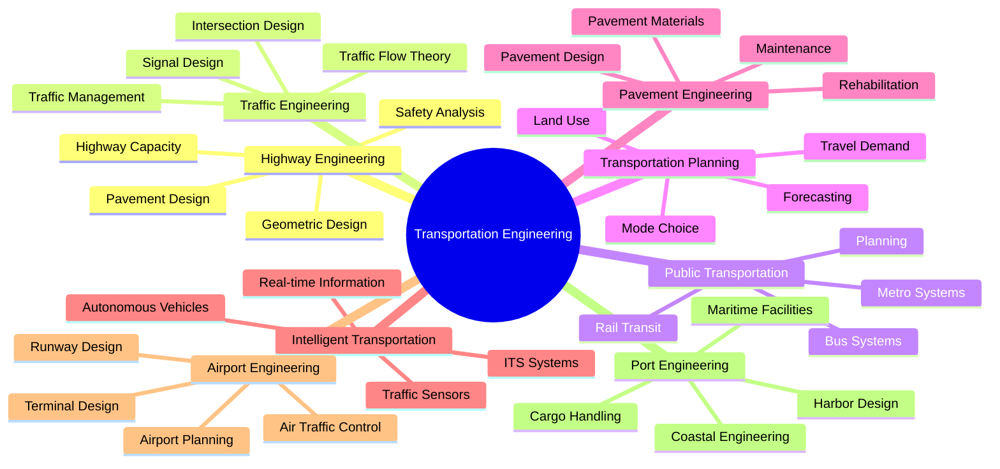

```mermaid
mindmap
  root((Transportation Engineering))
    Highway Engineering
      Geometric Design
      Pavement Design
      Highway Capacity
      Safety Analysis
    Traffic Engineering
      Traffic Flow Theory
      Signal Design
      Intersection Design
      Traffic Management
    Public Transportation
      Bus Systems
      Rail Transit
      Metro Systems
      Planning
    Transportation Planning
      Travel Demand
      Mode Choice
      Land Use
      Forecasting
    Pavement Engineering
      Pavement Materials
      Pavement Design
      Maintenance
      Rehabilitation
    Intelligent Transportation
      ITS Systems
      Traffic Sensors
      Real-time Information
      Autonomous Vehicles
    Airport Engineering
      Runway Design
      Terminal Design
      Air Traffic Control
      Airport Planning
    Port Engineering
      Harbor Design
      Maritime Facilities
      Cargo Handling
      Coastal Engineering
```

