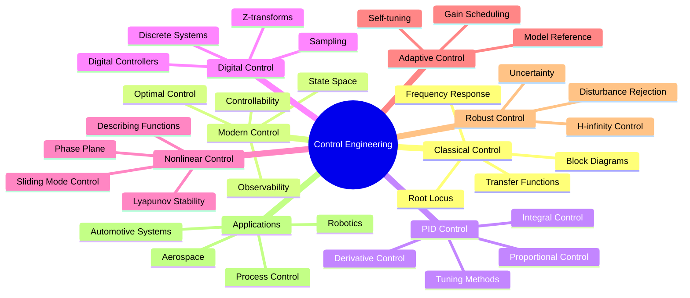

```mermaid
mindmap
  root((Control Engineering))
    Classical Control
      Transfer Functions
      Block Diagrams
      Root Locus
      Frequency Response
    Modern Control
      State Space
      Controllability
      Observability
      Optimal Control
    PID Control
      Proportional Control
      Integral Control
      Derivative Control
      Tuning Methods
    Digital Control
      Sampling
      Z-transforms
      Discrete Systems
      Digital Controllers
    Nonlinear Control
      Phase Plane
      Describing Functions
      Lyapunov Stability
      Sliding Mode Control
    Adaptive Control
      Model Reference
      Self-tuning
      Gain Scheduling
    Robust Control
      H-infinity Control
      Uncertainty
      Disturbance Rejection
    Applications
      Process Control
      Robotics
      Aerospace
      Automotive Systems
```

