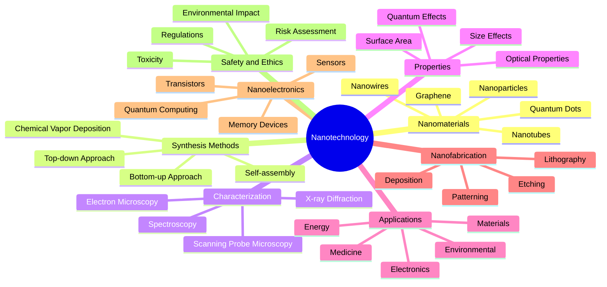

```mermaid
mindmap
  root((Nanotechnology))
    Nanomaterials
      Nanoparticles
      Nanotubes
      Nanowires
      Quantum Dots
      Graphene
    Synthesis Methods
      Top-down Approach
      Bottom-up Approach
      Self-assembly
      Chemical Vapor Deposition
    Characterization
      Electron Microscopy
      Scanning Probe Microscopy
      Spectroscopy
      X-ray Diffraction
    Properties
      Size Effects
      Surface Area
      Quantum Effects
      Optical Properties
    Applications
      Electronics
      Medicine
      Energy
      Environmental
      Materials
    Nanofabrication
      Lithography
      Etching
      Deposition
      Patterning
    Nanoelectronics
      Transistors
      Memory Devices
      Sensors
      Quantum Computing
    Safety and Ethics
      Toxicity
      Environmental Impact
      Regulations
      Risk Assessment
```

