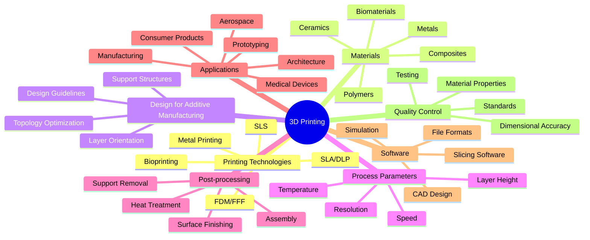

```mermaid
mindmap
  root((3D Printing))
    Printing Technologies
      FDM/FFF
      SLA/DLP
      SLS
      Metal Printing
      Bioprinting
    Materials
      Polymers
      Metals
      Ceramics
      Composites
      Biomaterials
    Design for Additive Manufacturing
      Topology Optimization
      Support Structures
      Layer Orientation
      Design Guidelines
    Process Parameters
      Resolution
      Speed
      Temperature
      Layer Height
    Post-processing
      Surface Finishing
      Heat Treatment
      Support Removal
      Assembly
    Applications
      Prototyping
      Manufacturing
      Medical Devices
      Aerospace
      Architecture
      Consumer Products
    Software
      CAD Design
      Slicing Software
      Simulation
      File Formats
    Quality Control
      Dimensional Accuracy
      Material Properties
      Testing
      Standards
```

