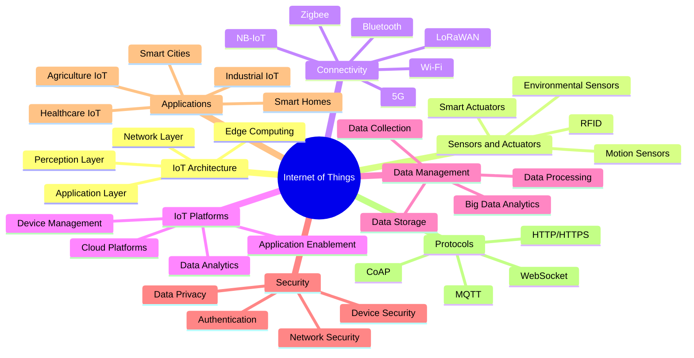

```mermaid
mindmap
  root((Internet of Things))
    IoT Architecture
      Perception Layer
      Network Layer
      Application Layer
      Edge Computing
    Sensors and Actuators
      Environmental Sensors
      Motion Sensors
      Smart Actuators
      RFID
    Connectivity
      Wi-Fi
      Bluetooth
      Zigbee
      LoRaWAN
      5G
      NB-IoT
    IoT Platforms
      Cloud Platforms
      Device Management
      Data Analytics
      Application Enablement
    Data Management
      Data Collection
      Data Storage
      Data Processing
      Big Data Analytics
    Security
      Device Security
      Network Security
      Data Privacy
      Authentication
    Applications
      Smart Homes
      Smart Cities
      Industrial IoT
      Healthcare IoT
      Agriculture IoT
    Protocols
      MQTT
      CoAP
      HTTP/HTTPS
      WebSocket
```

