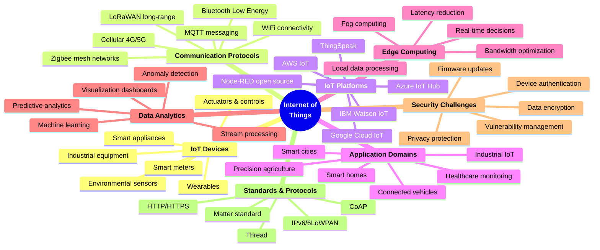

```mermaid
mindmap
  root((<b>Internet of<br>Things</b>))
    <b>IoT Devices</b>
      Environmental sensors
      Actuators & controls
      Wearables
      Smart appliances
      Industrial equipment
      Smart meters
    <b>Communication Protocols</b>
      WiFi connectivity
      Bluetooth Low Energy
      Cellular 4G/5G
      LoRaWAN long-range
      Zigbee mesh networks
      MQTT messaging
    <b>IoT Platforms</b>
      AWS IoT
      Azure IoT Hub
      Google Cloud IoT
      ThingSpeak
      Node-RED open source
      IBM Watson IoT
    <b>Application Domains</b>
      Smart homes
      Industrial IoT
      Smart cities
      Healthcare monitoring
      Precision agriculture
      Connected vehicles
    <b>Edge Computing</b>
      Local data processing
      Latency reduction
      Bandwidth optimization
      Real-time decisions
      Fog computing
    <b>Data Analytics</b>
      Stream processing
      Predictive analytics
      Anomaly detection
      Machine learning
      Visualization dashboards
    <b>Security Challenges</b>
      Device authentication
      Data encryption
      Privacy protection
      Firmware updates
      Vulnerability management
    <b>Standards & Protocols</b>
      HTTP/HTTPS
      CoAP
      IPv6/6LoWPAN
      Thread
      Matter standard
```

