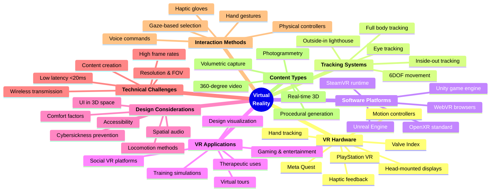

```mermaid
mindmap
  root((<b>Virtual<br>Reality</b>))
    <b>VR Hardware</b>
      Head-mounted displays
      Meta Quest
      PlayStation VR
      Valve Index
      Motion controllers
      Hand tracking
      Haptic feedback
    <b>Tracking Systems</b>
      Inside-out tracking
      Outside-in lighthouse
      6DOF movement
      Eye tracking
      Full body tracking
    <b>Software Platforms</b>
      Unity game engine
      Unreal Engine
      WebVR browsers
      SteamVR runtime
      OpenXR standard
    <b>VR Applications</b>
      Gaming & entertainment
      Training simulations
      Virtual tours
      Social VR platforms
      Therapeutic uses
      Design visualization
    <b>Design Considerations</b>
      Locomotion methods
      UI in 3D space
      Spatial audio
      Accessibility
      Comfort factors
      Cybersickness prevention
    <b>Technical Challenges</b>
      High frame rates
      Low latency <20ms
      Resolution & FOV
      Wireless transmission
      Content creation
    <b>Interaction Methods</b>
      Hand gestures
      Voice commands
      Gaze-based selection
      Physical controllers
      Haptic gloves
    <b>Content Types</b>
      360-degree video
      Real-time 3D
      Photogrammetry
      Volumetric capture
      Procedural generation
```

